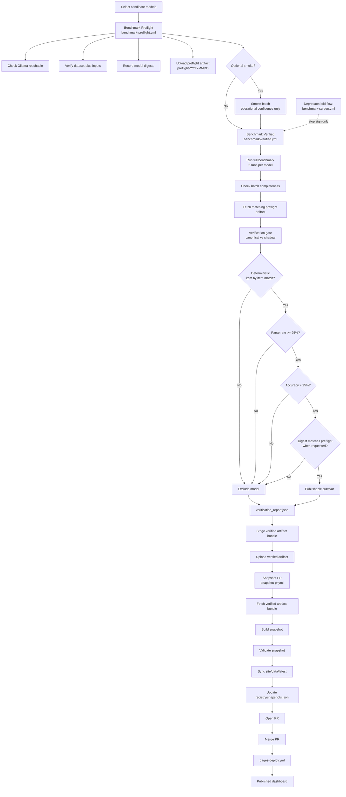

# panya-manee

Local LLM arena that benchmarks small models on Thailand's NT (National Test) Grade 3 exam questions via Ollama. Tests Thai language comprehension and math reasoning.

License: Apache-2.0

## Prerequisites

- Python 3.12+
- [Ollama](https://ollama.com) running locally
- At least one model pulled (e.g. `ollama pull qwen3:0.6b`)

## Setup

```bash
uv sync            # or: pip install -e .
```

## Usage

### Run a benchmark

```bash
uv run python main.py run --model qwen3:0.6b
uv run python main.py run --model gemma3:1b --subjects thai --run-id run002
uv run python main.py run --model llama3.2:1b --dry-run  # no API calls
```

### Thinking models

For models with thinking/reasoning (e.g. qwen3.5), use `--think` to set a token budget:

```bash
uv run python main.py run --model qwen3.5:9b --think 4096   # enable thinking, 4096 token budget
uv run python main.py run --model qwen3.5:9b --no-think     # disable thinking (default)
```

If the model hits the token limit mid-think (empty content), the runner will:
- Attempt to parse an answer from the thinking output (`thinking_fallback`)
- Show `⚠ BUDGET` warnings per-item and in the summary

### Summarize results

```bash
uv run python main.py summarize                  # all runs
uv run python main.py summarize --run-id run001  # specific run
```

## Dashboard

A static public dashboard shows benchmark results at a glance. No build step required — plain HTML/CSS/JS consuming pre-built JSON.

### Local preview

```bash
# If you have a snapshot in dist/, publish it to site/data/latest/:
python scripts/publish_snapshot.py --batch-id mini-r10-20260409

# Or just preview what's already synced:
sh scripts/serve.sh
# Open http://localhost:8000
```

### Publish flow

```bash
# 1. Build, validate, sync to site, update registry — one command:
python scripts/publish_snapshot.py --batch-id mini-r10-20260409

# 2. Dry-run (build + validate only, no side effects):
python scripts/publish_snapshot.py --batch-id mini-r10-20260409 --dry-run

# 3. Commit the updated site data and registry:
git add site/data/ registry/
git commit -m "Publish snapshot nt-p3-mcq-text-only-mini-r10-20260409"

# 4. Open a PR to main. After merge, GitHub Pages deploys automatically.
```

### Benchmark publication pipeline



Current production path:

- `benchmark-preflight.yml`
- optional smoke batch
- `benchmark-verified.yml` on all candidates, 2x each
- post-hoc survivor filter from `verification_report_{batch_id}.json`
- `snapshot-pr.yml`
- `pages-deploy.yml`

`benchmark-screen.yml` is deprecated and intentionally not part of the live publication flow.

### Individual scripts

| Script | Purpose |
|---|---|
| `scripts/build_snapshot.py` | Build snapshot bundle from batch data |
| `scripts/validate_snapshot.py` | Validate snapshot cross-file consistency |
| `scripts/sync_site_data.py` | Copy snapshot files to `site/data/latest/` |
| `scripts/verify_site.py` | Verify site HTML/JS wiring to data |
| `scripts/publish_snapshot.py` | End-to-end: build → validate → sync → registry |

### GitHub Pages deployment

The `.github/workflows/pages-deploy.yml` workflow deploys `site/` to GitHub Pages on push to `main` when `site/**` or `registry/snapshots.json` changes. Prerequisites:

1. In repo Settings → Pages → Source, select **GitHub Actions**
2. Ensure `site/data/latest/` contains snapshot data (committed via publish flow above)

## License

This project is licensed under the Apache License, Version 2.0. See `LICENSE`.

## How it works

1. Loads MCQ items from `nt-tests/` JSON files
2. Validates data integrity (no BOM, required keys present)
3. Prompts the model in Thai to answer with just a digit (1-4)
4. Parses model output and compares to ground truth
5. Saves detailed JSONL results to `benchmark_responses/`
6. Displays live progress and rich summary by subject and skill tag

## Test Data Landscape (as of 2026-04-09)

**Source**: NT (National Test) Grade 3, Thailand — Years 2565, 2566, 2567 (2022–2024)

180 total items: 90 Thai + 90 Math, evenly split across 3 years (30 per year per subject).

### Eval splits

| Split | Thai | Math | Status |
|---|---|---|---|
| `text_only_core` | 60 | 33 | Runnable now |
| `vision_extended` | 18 | 45 | Needs image extraction from PDFs |
| `written_manual` | 12 | 3 | Needs human/rubric scoring |
| `written_auto` | — | 9 | Needs exact-match scorer |

### Answer types

| Type | Thai | Math |
|---|---|---|
| `mcq_single` | 78 | 78 |
| `short_written` | 9 | — |
| `free_written` | 3 | — |
| `numeric_short` | — | 9 |
| `worked_solution` | — | 3 |

### Runnable now — skill tags

#### Thai (60 items, all MCQ)

| skill_tag | count |
|---|---|
| reading_comprehension | 19 |
| reading_literature | 11 |
| parts_of_speech | 7 |
| moral_application | 6 |
| moral_extraction | 6 |
| sentence_type | 6 |
| reasoning_question | 5 |
| word_meaning | 4 |
| story_prediction | 3 |
| applied_reading | 3 |
| judgment_from_text | 3 |
| verb_identification | 3 |
| standard_thai | 3 |

Plus 27 more tags with 1–2 items each (spelling, classification, pronoun identification, etc.)

#### Math (33 items, all MCQ)

| skill_tag | count |
|---|---|
| word_problem | 7 |
| fraction_addition | 7 |
| fraction_subtraction | 7 |
| data_interpretation | 6 |
| comparison | 6 |
| length | 5 |
| unit_conversion | 5 |
| two_step_problem | 4 |
| table_reading | 4 |
| number_pattern | 3 |
| pictograph | 3 |
| addition_subtraction_with_units | 2 |
| number_ordering | 2 |
| division | 2 |
| multiplication | 2 |
| time | 2 |
| duration | 2 |
| money | 1 |
| capacity | 1 |

### Not runnable yet — skill tags

#### Thai (30 items: 18 vision + 12 written)

| skill_tag | mcq_single | free_written | short_written | total |
|---|---|---|---|---|
| visual_reading | 8 | | | 8 |
| creative_writing | | 3 | 3 | 6 |
| information_identification | 4 | | | 4 |
| image_description | | | 3 | 3 |
| sentence_writing | | | 3 | 3 |
| slogan_writing | | | 3 | 3 |
| short_reasoning | | | 3 | 3 |
| literature_response | | | 3 | 3 |
| imaginative_story | | 3 | | 3 |
| map_reading | 3 | | | 3 |
| visual_inference | 3 | | | 3 |

Plus 14 more tags with 1–2 items each.

#### Math (57 items: 45 vision + 9 written_auto + 3 written_manual)

| skill_tag | mcq_single | numeric_short | worked_solution | total |
|---|---|---|---|---|
| word_problem | 7 | 6 | 3 | 16 |
| multiplication | 5 | 3 | 2 | 10 |
| addition_subtraction_with_units | 7 | 1 | 1 | 9 |
| weight | 6 | 3 | | 9 |
| money | 3 | 4 | 1 | 8 |
| time | 7 | | | 7 |
| duration | 7 | | | 7 |
| unit_conversion | 4 | 1 | | 5 |
| capacity | 5 | | | 5 |
| addition | 2 | 1 | 2 | 5 |
| fraction_comparison | 4 | | | 4 |
| length | 4 | | | 4 |

Plus 17 more tags with 1–3 items each.
